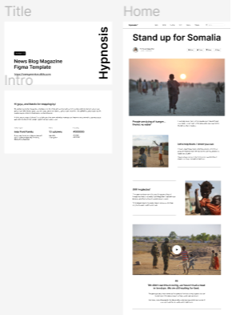

# Project_HTML StrUctUre
This is basically a practice with HTML's <strong>Tags</strong>, here we are going to learn how to identify the website's structure from a figma design.

At the same time, we must learn about soft skills and practice them to break blocks working as a team!

## Built With

- HTML
- Figma design

## Authors

👤 **Author1**

- GitHub: [@Edjhernandez](https://github.com/Edjhernandez)
- Twitter: [@EdjhernandezM](https://twitter.com/EdjhernandezM)
- LinkedIn: [@LinkedIn](https://linkedin.com/in/eduardo-jose-hernandez-marin-53b27358/)

## 🤝 Contributing

Figma designer

## Show your support

Give a ⭐️ if you like this project!

## Acknowledgments

- Beginners Inspiration

## 📝 License

This project is [MIT](./MIT.md) licensed.